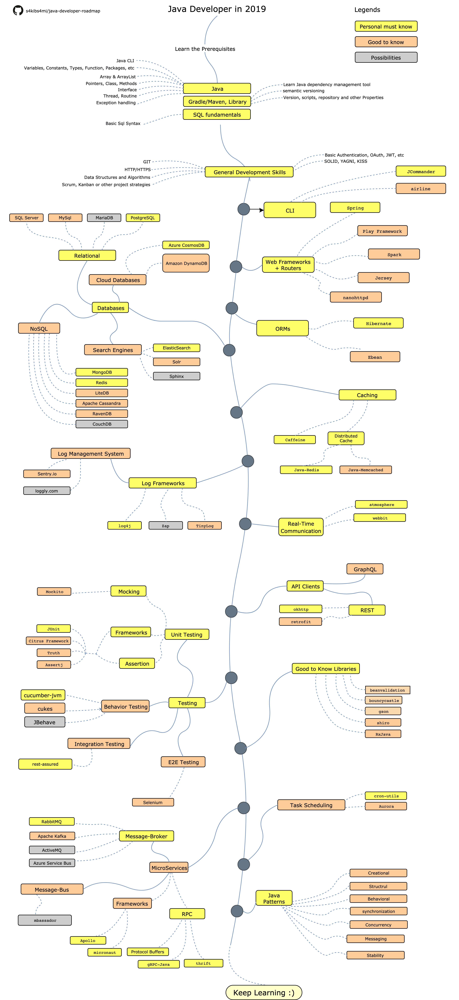

# Learning-JAVA
## JAVA
Links to courses, which could help begin your journey with JAVA. 
Tim Buchalka, best video course I ever found https://www.udemy.com/share/1000wYAkcbdVlbQ3w=/ [ENG]  
Samouczek Programisty http://www.samouczekprogramisty.pl/kurs-programowania-java/ [PL]  
Good step by step Java course  http://moocfi.github.io/courses/2013/programming-part-1/ [ENG] 
JAVA BRAINS https://www.youtube.com/user/koushks  
Good practises and designs in JAVA http://www.javapractices.com/home/HomeAction.do  
### JAVA SE 8 
JUG Optionals, Lambdas, Streams. Good examples,how to use properly https://youtu.be/bjaNWBKQroA  

## SPRING
### Blogi o Spring Boot warte uwagi:
Przemysław Bykowski http://bykowski.pl  
Yet another technical blog http://blog.mloza.pl/
### Spring Data JPA
JPA basics, Really helping when you make your first steps with JPA: 
https://docs.oracle.com/javaee/5/tutorial/doc/bnbqa.html 
https://docs.oracle.com/javaee/7/tutorial/partpersist.htm#BNBPY 
next step should be actual <b>Spring Data JPA reference</b> 
Jakub Kubryński JPA - beyond copy-paste https://www.youtube.com/watch?v=UPWkpl5PL_w  
## Others...
https://12factor.net/pl/ Metodologia dwunastu aspektów, czyli jak wytwarzać nowoczesne, łatwe w utrzymaniu oprogramowanie typu <i>SaaS software-as-a-service</i> [PL]  
REST - know the rules https://www.youtube.com/watch?v=lGLGW7EOzVY  

## ON YOUR ROAD TO BE A BETTER PROFESSIONAL
https://github.com/akullpp/awesome-java  
https://github.com/Vedenin/useful-java-links  
https://github.com/java-lang/awesome-java  
https://github.com/s4kibs4mi/java-developer-roadmap  

## STYLE GUIDES
and remember <b>Java was created for writing best looking code</b>!  
https://google.github.io/styleguide/javaguide.html  
https://github.com/twitter/commons/blob/master/src/java/com/twitter/common/styleguide.md  
https://petroware.no/javastyle.html  
